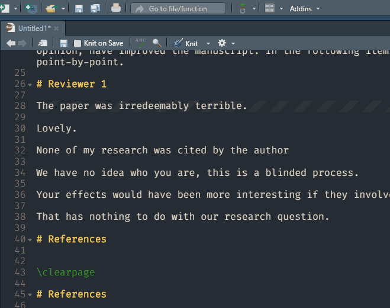

<!-- README.md is generated from README.Rmd. Please edit that file -->

```{r, include = FALSE}
knitr::opts_chunk$set(
  collapse = TRUE,
  comment = "#>",
  out.width = "100%"
)
```

# revise

<!-- badges: start -->
<!-- badges: end -->

The goal of revise is to support authors in responding to revise and resubmit requests. These functions are designed to work with [crsh/papaja](https://github.com/crsh/papaja).

## Installation

You can install the development version of {revise} from [GitHub](https://github.com/conig/revise) with:

``` r
# install.packages("remotes")
remotes::install_github("conig/revise")
```
## Examples

### ReviewerComment addin

We have included an addin so you can mark text as a reviewer comment. This will automatically insert code around that selection of text, such that it will be formatted as a comment in papaja::revision_letter_pdf documents. Comments will also be automatically numbered. A hotkey can be set for this addin (e.g. Ctrl+Shift+R).



