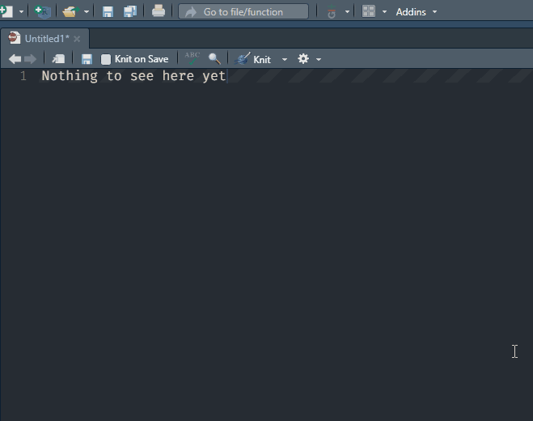

<!-- README.md is generated from README.Rmd. Please edit that file -->

# revise

<!-- badges: start -->

[](https://github.com/conig/revise/actions)
<!-- badges: end -->

The goal of revise is to support authors in responding to revise and
resubmit requests. These functions are designed to work with
[crsh/papaja](https://github.com/crsh/papaja).

## Installation

You can install the development version of {revise} from
[GitHub](https://github.com/conig/revise) with:

``` r
# install.packages("remotes")
remotes::install_github("conig/revise")
```

## Examples

### ReviewerComment addin

We have included an addin so you can mark text as a reviewer comment.
This will automatically insert code around that selection of text so
that it will appear as a numbered comment in papaja::revision_letter_pdf
documents. Comments will also be automatically numbered. A hotkey can be
set for this addin (e.g. Ctrl+Shift+R).


If a YAML header is not detected in document the addin will add it,
Other syntax will also be appended around existing text such that the
user can quickly work with revise functions.


